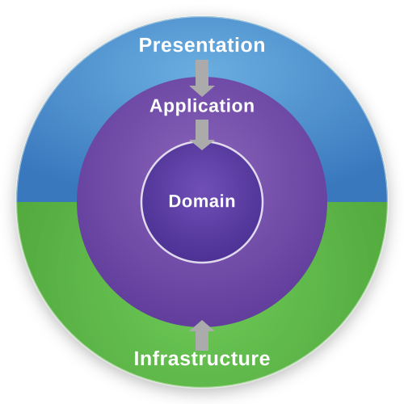

<p align="center">
  
</p>

# Python Clean Event-Driven Architecture

A Python template for event-driven applications with Clean Architecture, MQTT inbound/outbound messaging, a message router, an event bus, a background thread runner, and Unit of Work based database transactions.

---

# Why Clean Architecture?

As applications grow, business logic often becomes tightly coupled with:
- databases
- messaging systems
- frameworks
- external services
- infrastructure code

This makes systems:
- difficult to test
- hard to maintain
- difficult to scale
- tightly coupled to implementation details

Clean Architecture helps solve this by separating the application into clear layers with explicit responsibilities.

Benefits:
- independent business logic
- easier testing
- lower coupling
- better maintainability
- replaceable infrastructure
- scalable architecture for long-term projects

The goal is to keep the core business rules independent from:
- databases
- frameworks
- transport protocols
- external systems

This template demonstrates how to structure an event-driven Python application while keeping dependency direction clean and maintainable.

---

## Table of Contents

- [Architecture Overview](#architecture-overview)
- [Runtime Overview](#runtime-overview)
- [Flow 1 - MQTT Inbound to Router to Use Case](#flow-1---mqtt-inbound-to-router-to-use-case)
- [Flow 2 - Thread Runner to Event Bus to MQTT Outbound](#flow-2---thread-runner-to-event-bus-to-mqtt-outbound)
- [Flow 3 - Unit of Work Transaction in Infrastructure](#flow-3---unit-of-work-transaction-in-infrastructure)
- [Message Router](#message-router)
- [Event Bus](#event-bus)
- [MQTT Client](#mqtt-client)
- [Bootstrap Composition Root](#bootstrap-composition-root)
- [Dependency Rules](#dependency-rules)
- [Project Structure](#project-structure)

---

## Architecture Overview

The system is split into four layers. Dependencies point inward: outer layers can know inner layers, but inner layers never know outer layers.

```
┌─────────────────────────────────────────────┐
│              Presentation                   │  Message router, MQTT handlers
├─────────────────────────────────────────────┤
│              Application                    │  Use cases, state manager, interfaces
├─────────────────────────────────────────────┤
│               Domain                        │  Entities, events, repository contracts
├─────────────────────────────────────────────┤
│            Infrastructure                   │  Postgres, MQTT client, event bus, runner
└─────────────────────────────────────────────┘
```

The important idea:

```txt
Application code depends on abstractions.
Infrastructure code implements those abstractions.
Bootstrap wires everything together.
```

Example:

```txt
RegisterDeviceUseCase
  depends on UnitOfWork interface + DeviceRepository interface

PostgresUnitOfWork
  implements UnitOfWork using psycopg2 connection pool

PostgresDeviceRepository
  implements DeviceRepository using SQL
```

---

## Runtime Overview

There are two main runtime paths:

| Runtime path | Purpose |
|--------------|---------|
| MQTT listener | Receives broker messages and dispatches them to use cases |
| Thread runner | Runs a periodic loop that publishes device-online events |

At startup:

```txt
main.py
  ├─ build_application()
  ├─ starts DeviceRuntimeRunner.run() in a daemon Thread
  └─ keeps the process alive
```

The MQTT network loop is handled by `paho-mqtt` through `MqttClient.connect()`, which calls `client.loop_start()`.

---

## Flow 1 - MQTT Inbound to Router to Use Case

When the broker receives a device registration message:

```txt
MQTT Broker
     │
     │ topic: "device/register"
     │ payload: {"device_id": "device-42"}
     ▼
MqttClient._cb_message()
     │
     │ converts raw paho message into (topic: str, payload: bytes)
     ▼
MqttClient.on_message(topic, payload)
     │
     │ wired in bootstrap:
     │ mqtt_client.on_message = router.dispatch
     ▼
MessageRouter.dispatch(topic, payload)
     │
     │ finds handler by topic key
     ▼
RegisterDeviceMessageHandler.__call__(topic, payload)
     │
     │ validates payload with RegisterDeviceRequest
     │ requires device_id to be a non-empty string
     │ creates a fresh use case through factory
     ▼
RegisterDeviceUseCase.execute(device_id)
     │
     │ opens UnitOfWork transaction
     ▼
PostgresUnitOfWork.__enter__()
     │
     │ borrows connection from ThreadedConnectionPool
     ▼
PostgresDeviceRepository.save(device)
     │
     │ executes SQL using cursor from UnitOfWork connection
     ▼
uow.commit()
     │
     │ commits PostgreSQL transaction
     ▼
StateManager.update_device_registration(True)
```

Key files:

| File | Role |
|------|------|
| `infrastructure/messaging/mqtt/mqtt_client.py` | Paho MQTT wrapper; receives raw broker messages |
| `presentation/messaging/router.py` | Maps topic string to handler callable |
| `bootstrap/message_router.py` | Registers topic handlers |
| `presentation/messaging/mqtt/handlers/register_device_message_handler.py` | Validates MQTT payload and calls use case |
| `presentation/messaging/mqtt/requests/register_device_request.py` | Defines validated registration payload shape |
| `application/usecase/register_device_usecase.py` | Application business flow for device registration |
| `application/interface/persistence/unit_of_work.py` | UnitOfWork interface used by use cases |
| `infrastructure/persistence/database/postgres_unit_of_work.py` | PostgreSQL UnitOfWork implementation |
| `infrastructure/persistence/repositories/device/postgres_device_repository.py` | SQL implementation of device repository |

Router example:

```python
router = MessageRouter()

router.register(
    "device/register",
    RegisterDeviceMessageHandler(create_usecase=...)
)

router.dispatch("device/register", b'{"device_id": "device-42"}')
```

The router calls the handler as:

```python
handler(topic, payload)
```

---

## Flow 2 - Thread Runner to Event Bus to MQTT Outbound

The app also has a background runtime loop. It periodically publishes a device-online event.

```txt
main.py
     │
     │ starts daemon thread
     ▼
DeviceRuntimeRunner.run()
     │
     │ while True:
     │   create fresh SendDeviceOnlineUseCase
     │   execute(device_id)
     │   sleep(interval_seconds)
     ▼
SendDeviceOnlineUseCase.execute(device_id)
     │
     │ creates domain event
     ▼
DeviceOnlineEvent(device_id, timestamp)
     │
     ▼
BaseEventBus.publish(event)
     │
     │ concrete implementation: InMemoryEventBus
     ▼
InMemoryEventBus.publish(event)
     │
     │ finds handlers subscribed for DeviceOnlineEvent
     ▼
MQTTSendDeviceOnlineHandler.__call__(event)
     │
     │ converts event into DeviceOnlineMessage
     ▼
MqttClient.publish(
    topic="device/online",
    payload=message.to_bytes()
)
     │
     ▼
MQTT Broker
```

Key files:

| File | Role |
|------|------|
| `main.py` | Starts app and daemon thread |
| `infrastructure/runner/device_runtime_runner.py` | Periodic `while True` runner |
| `application/usecase/send_device_online_usecase.py` | Creates and publishes `DeviceOnlineEvent` |
| `domain/events/device_online_event.py` | Pure domain event |
| `domain/interface/messaging/event_bus.py` | Event bus abstraction |
| `infrastructure/event_bus/in_memory_event_bus.py` | In-process event bus implementation |
| `bootstrap/event_bus.py` | Subscribes event handlers at startup |
| `infrastructure/event_handlers/mqtt_send_device_online_handler.py` | Converts domain event to MQTT publish |
| `infrastructure/messaging/mqtt/messages/device_online_message.py` | MQTT payload DTO |

The use case only knows `BaseEventBus`. It does not know MQTT exists.

That is the clean part:

```txt
SendDeviceOnlineUseCase -> BaseEventBus
InMemoryEventBus        -> handler list
MQTT handler            -> MqttClient.publish()
```

To swap MQTT outbound for Kafka outbound, replace the subscribed event handler in bootstrap. The use case stays untouched.

---

## Flow 3 - Unit of Work Transaction in Infrastructure

This is the important transaction design in the current template.

The use case owns the application flow, but infrastructure owns the database mechanics.

```txt
application/interface/persistence/unit_of_work.py
    UnitOfWork ABC
        ├─ __enter__()
        ├─ __exit__()
        ├─ commit()
        └─ rollback()

infrastructure/persistence/database/postgres_unit_of_work.py
    PostgresUnitOfWork
        ├─ borrows connection from pool
        ├─ exposes active connection to repositories
        ├─ commits on success when use case calls commit()
        ├─ rolls back on exception
        └─ returns connection to pool
```

Register device transaction:

```python
def execute(self, device_id: str) -> None:
    with self._uow as uow:
        device = Device(
            device_id=device_id,
            is_registered=True,
        )

        self._device_repository.save(device)

        uow.commit()

    self._state_manager.update_device_registration(True)
```

What happens under the hood:

```txt
with self._uow as uow
  │
  ├─ PostgresUnitOfWork.__enter__()
  │    └─ conn = pool.getconn()
  │
  ├─ repository.save(device)
  │    └─ cursor = uow.connection.cursor()
  │    └─ cursor.execute(INSERT INTO device ...)
  │
  ├─ uow.commit()
  │    └─ conn.commit()
  │
  └─ PostgresUnitOfWork.__exit__()
       ├─ if exception: conn.rollback()
       └─ pool.putconn(conn)
```

Why this is clean:

- The application layer depends on `UnitOfWork`, not `psycopg2`.
- The use case says "this operation is atomic" without knowing how PostgreSQL works.
- The repository interface does not receive a raw `tx` or cursor parameter.
- SQL and cursor usage stay inside infrastructure repositories.
- Connection pooling, commit, rollback, and connection return happen in infrastructure.

Why this is nice for a large project:

```txt
Use case:
  controls business flow and transaction boundary

UnitOfWork interface:
  gives application a stable abstraction

PostgresUnitOfWork:
  owns concrete database transaction mechanics

Repository:
  owns SQL details
```

This is the powerful part: the transaction is visible at the use-case level as a business boundary, but the database details are hidden in infrastructure.

---

## Message Router

`MessageRouter` is a small presentation component that maps an incoming route/topic to a handler.

```python
RouteHandler = Callable[[str, bytes], Any]
```

```txt
MessageRouter
  ├─ register(route, handler)
  └─ dispatch(route, payload)
       ├─ handler = _handlers.get(route)
       ├─ if missing: ignore
       └─ handler(route, payload)
```

Current registration:

```txt
"device/register" -> RegisterDeviceMessageHandler
```

The router does not know MQTT, JSON, database, or use-case internals. It only knows topic-like routes and callables.

---

## Event Bus

The event bus decouples application use cases from side effects.

```txt
BaseEventBus
  ├─ publish(event)
  └─ subscribe(event_type, handler)
```

Current implementation:

```txt
InMemoryEventBus
  └─ dict[type, list[handler]]
```

Startup subscription:

```python
event_bus.subscribe(
    DeviceOnlineEvent,
    MQTTSendDeviceOnlineHandler(mqtt_client),
)
```

Runtime publish:

```python
event_bus.publish(
    DeviceOnlineEvent(device_id=device_id, timestamp=...)
)
```

This keeps the use case clean:

```txt
Use case publishes a domain event.
Infrastructure decides what side effect happens.
```

---

## MQTT Client

`MqttClient` is an infrastructure wrapper around `paho-mqtt`.

Responsibilities:

- Create and configure the paho client.
- Apply username/password when provided.
- Enable TLS when configured.
- Start the paho network loop using `loop_start()`.
- Convert paho messages into `(topic: str, payload: bytes)`.
- Store subscriptions as `(topic, qos)` pairs.
- Re-subscribe after connect.
- Publish messages with a lock to keep outbound publishing thread-safe.

Inbound callback:

```txt
paho on_message
  -> MqttClient._cb_message
  -> self.on_message(topic, payload)
  -> MessageRouter.dispatch(topic, payload)
```

Outbound call:

```txt
MQTTSendDeviceOnlineHandler
  -> MqttClient.publish("device/online", payload)
```

Current subscriptions:

```txt
device/config   qos=0
device/register qos=1
device/publish  qos=1
```

---

## Bootstrap Composition Root

`bootstrap/application.py` is the composition root. This is the place where concrete infrastructure is allowed to meet application abstractions.

```txt
build_application()
  │
  ├─ load_config()
  │    ├─ database config
  │    ├─ mqtt config
  │    └─ device config
  │
  ├─ init_database(config.database)
  │    └─ returns ThreadedConnectionPool
  │
  ├─ StateManager()
  ├─ InMemoryEventBus()
  ├─ MqttClient(...)
  │
  ├─ ApplicationContainer(
  │     pool,
  │     state_manager,
  │     event_bus,
  │     mqtt_client,
  │   )
  │
  ├─ register_events(container)
  │    └─ DeviceOnlineEvent -> MQTTSendDeviceOnlineHandler
  │
  ├─ register_message_handlers(...)
  │    └─ "device/register" -> RegisterDeviceMessageHandler
  │
  ├─ mqtt_client.on_message = router.dispatch
  ├─ mqtt_client.connect()
  ├─ mqtt_client.subscribe([...])
  │
  └─ DeviceRuntimeRunner(
       create_usecase=lambda: build_send_device_online_usecase(container),
       device_id=config.device.device_id,
     )
```

Use case factories live under:

```txt
bootstrap/usecase_factories/
  ├─ scoped_factories.py
  └─ singleton_factories.py
```

The scoped factory creates a fresh `PostgresUnitOfWork` for flows that need their own transactional scope.

---

## Dependency Rules

```txt
Presentation   -> Application -> Domain
Infrastructure -> Application -> Domain
Domain         -> nothing outward
```

| Layer | Can import from | Cannot import from |
|-------|-----------------|--------------------|
| Domain | standard library only / pure domain modules | Application, Infrastructure, Presentation |
| Application | Domain, application interfaces/state | Infrastructure, Presentation |
| Infrastructure | Application, Domain | Presentation |
| Presentation | Application, Domain | Infrastructure |

Bootstrap is the exception by design: it is the composition root that wires presentation, application, domain abstractions, and infrastructure implementations.

---

## Project Structure

```txt
py-clean-event-driven-architecture/
│
├── main.py
│   └── builds the app and starts DeviceRuntimeRunner in a daemon thread
│
├── domain/
│   ├── entities/
│   │   └── device.py
│   ├── events/
│   │   └── device_online_event.py
│   ├── interface/
│   │   ├── messaging/
│   │   │   └── event_bus.py
│   │   └── repositories/
│   │       └── device_repository.py
│   └── services/
│       └── pricing_service.py
│
├── application/
│   ├── interface/
│   │   └── persistence/
│   │       └── unit_of_work.py
│   ├── state/
│   │   ├── device_state.py
│   │   ├── screenshot_state.py
│   │   └── state_manager.py
│   └── usecase/
│       ├── create_order_usecase.py
│       ├── register_device_usecase.py
│       └── send_device_online_usecase.py
│
├── bootstrap/
│   ├── application.py
│   ├── container.py
│   ├── database.py
│   ├── event_bus.py
│   ├── message_router.py
│   ├── mqtt.py
│   ├── services.py
│   └── usecase_factories/
│       ├── scoped_factories.py
│       └── singleton_factories.py
│
├── config/
│   ├── config.py
│   ├── database.py
│   ├── device.py
│   ├── mqtt.py
│   ├── http.py
│   ├── jwt.py
│   └── logger.py
│
├── infrastructure/
│   ├── event_bus/
│   │   ├── in_memory_event_bus.py
│   │   ├── kafka_event_bus.py
│   │   └── rabbitmq_event_bus.py
│   ├── event_handlers/
│   │   └── mqtt_send_device_online_handler.py
│   ├── messaging/
│   │   └── mqtt/
│   │       ├── mqtt_client.py
│   │       └── messages/
│   │           └── device_online_message.py
│   ├── persistence/
│   │   ├── database/
│   │   │   ├── database.py
│   │   │   ├── postgres_unit_of_work.py
│   │   │   └── migrations/
│   │   │       └── init_schema.py
│   │   └── repositories/
│   │       ├── base_repository.py
│   │       └── device/
│   │           └── postgres_device_repository.py
│   └── runner/
│       └── device_runtime_runner.py
│
└── presentation/
    ├── messaging/
    │   ├── router.py
    │   ├── kafka/
    │   │   └── kafka_consumer.py
    │   └── mqtt/
    │       ├── mqtt_consumer.py
    │       └── handlers/
    │           └── register_device_message_handler.py
    └── http/
        ├── controllers/
        ├── presenters/
        ├── requests/
        ├── responses/
        └── routes/
```

---

## Why This Template Scales

- MQTT inbound is isolated in infrastructure and presentation.
- Message routing is tiny and replaceable.
- Use cases stay focused on application behavior.
- Domain events describe what happened without knowing side effects.
- Event handlers convert domain events into infrastructure actions.
- UnitOfWork keeps transaction mechanics in infrastructure.
- Bootstrap owns object wiring so application code never imports concrete adapters.

This keeps the template clean for a larger project without hiding the runtime flow.
